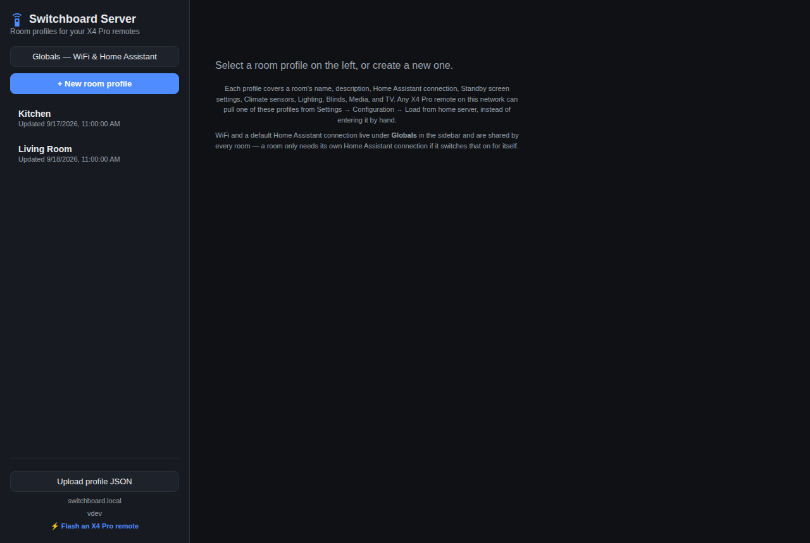
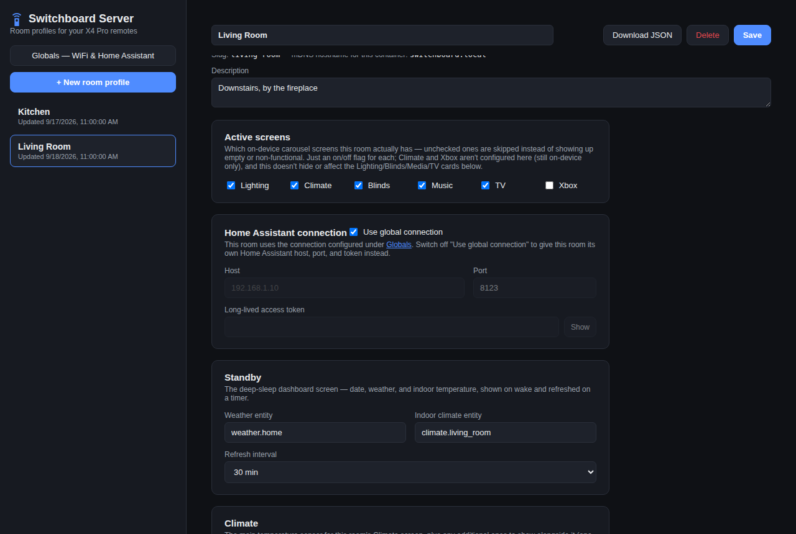
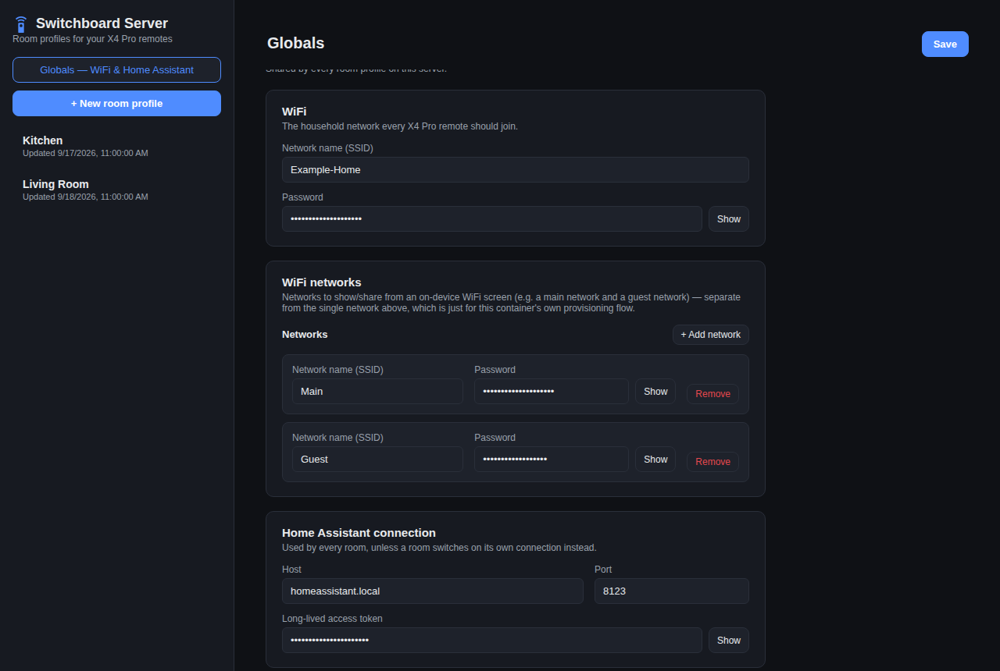

# Switchboard Server

The home server companion for [Switchboard](https://github.com/stumarti/Switchboard), the X4 Pro smart-home remote. Run one instance for your whole household — it stores each room's setup (lighting, blinds, climate, media, TV) and every remote pulls its config from it, instead of you typing it in by hand on each device.

**[⚡ Flash an X4 Pro remote](https://stumarti.github.io/Switchboard/)**

## Screenshots

<table>
<tr>
  <td><br><sub>Room list</sub></td>
  <td><br><sub>Editing a room</sub></td>
</tr>
<tr>
  <td colspan="2"><br><sub>Globals — shared WiFi & Home Assistant</sub></td>
</tr>
</table>

## Quick start (Docker Compose)

```yaml
services:
  switchboard-server:
    image: ghcr.io/stumarti/switchboard-server:latest
    container_name: switchboard-server
    network_mode: host   # required — mDNS needs it, see below
    environment:
      - PORT=45678
      - MDNS_HOSTNAME=switchboard.local
    volumes:
      - ./data:/data
    restart: unless-stopped
```

```sh
mkdir -p data
docker compose up -d
```

Open `http://<your-server-ip>:45678`, create a room, done. Every Switchboard remote on your network finds it automatically via `switchboard.local`.

This exact file is `docker-compose.yml` in this repo — grab it directly instead of retyping it.

### On Unraid

Add Container → Template → point it at this repo's `unraid-template.xml`. Set the **Data** path to wherever you want profiles saved (defaults to `/mnt/user/appdata/switchboard-server/data`) and apply.

> **Host networking required.** mDNS (how remotes find `switchboard.local` automatically) needs multicast, which doesn't cross Docker's default bridge network. Without `network_mode: host`, the admin UI still works fine at `http://<ip>:45678` — remotes just can't auto-discover it, and you'd need to set the host/port by hand in each remote's firmware config.

### Private image?

If this repo is private, GHCR images are private by default too — `docker login ghcr.io -u stumarti` with a GitHub token (`read:packages` scope) before pulling. Or make the package public from its GitHub page if you'd rather skip that.

## What it does

- One JSON profile per room (lighting, blinds, media, climate, TV, which carousel screens are on) — edit them from a browser instead of the on-device form.
- A shared **Globals** page for WiFi and your Home Assistant connection, so you only enter those once.
- Advertises itself on the LAN (`switchboard.local`) so remotes find it with zero configuration.

Every Switchboard remote already talks to this: `Settings → Select room` calls `GET /api/devices`, then pulls that room's full config from `GET /api/devices/<slug>/config`. `GET /api/globals` supplies the shared WiFi/HA connection.

| Method | Path | Purpose |
|---|---|---|
| GET | `/api/devices` | List rooms |
| GET | `/api/devices/<slug>/config` | One room's full config |
| POST | `/api/devices/<slug>/config` | Create/update a room |
| POST | `/api/devices` | Create a room from just a name |
| DELETE | `/api/devices/<slug>` | Remove a room |
| GET / POST | `/api/globals` | Shared WiFi + Home Assistant connection |
| GET | `/api/health` | Liveness, version, mDNS info |

## Cutting a release

```sh
git tag v1.0.0
git push origin v1.0.0
```

That's it — `.github/workflows/release.yml` builds the image and pushes `ghcr.io/stumarti/switchboard-server:latest` and `:1.0.0`, and creates a GitHub Release. `.github/workflows/ci.yml` runs a lighter build-check on every push so a broken build never gets that far.

## Config reference

| Variable | Default | What it does |
|---|---|---|
| `PORT` | `45678` | HTTP port |
| `DATA_DIR` | `/data` | Where room profiles are stored |
| `MDNS_HOSTNAME` | `switchboard.local` | Hostname advertised on the LAN |
| `MDNS_SERVICE_TYPE` | `switchboard` | DNS-SD service type — carries the port automatically for anything that queries it properly |
| `MDNS_IP` / `MDNS_INTERFACE` | auto | Force the advertised IP/NIC if auto-detect picks wrong (common on multi-NIC boxes) |
| `DISABLE_MDNS` | off | Set `1` to turn off discovery entirely |

## Security

Plain HTTP, no login, LAN-only by design — same as the on-device config form it replaces. This one holds *every* room's Home Assistant token plus your WiFi password in one place, so: keep it off the internet, don't port-forward it, and treat it like any other credential store on your network.

## Secrets & your first commit

`data/` holds real credentials once you start using this — Home Assistant tokens, WiFi passwords. `.gitignore` already excludes it (`data/*`, keeping only `.gitkeep`), so it's safe to `git add -A` without checking each time.

One gotcha in local dev: running `npm start` without setting `DATA_DIR` writes straight into this repo's own `data/` folder. Harmless now that it's gitignored, but set `DATA_DIR` to somewhere outside the repo anyway (e.g. `DATA_DIR=/tmp/sb-dev`) so test data doesn't pile up here.

## Local development

```sh
npm install
DATA_DIR=/tmp/sb-dev DISABLE_MDNS=1 npm start
```

Open `http://localhost:45678`.

## Profile shape

Each room profile, in full:

```json
{
  "slug": "living-room",
  "name": "Living Room",
  "description": "",
  "homeAssistant": { "useGlobal": true, "host": "", "port": 8123, "token": "" },
  "standby": { "weatherEntity": "weather.home", "climateEntity": "climate.living_room", "refreshIntervalMin": 30 },
  "lighting": {
    "group": { "enabled": true, "name": "All lights", "entity": "light.living_room_group", "controls": { "brightness": true, "colorTemp": true, "color": false, "effects": false } },
    "lights": [ { "id": "...", "name": "Lamp", "entity": "light.lamp", "controls": { "brightness": true, "colorTemp": true, "color": true, "effects": true } } ],
    "scenes": [ { "id": "...", "name": "Movie Night", "entity": "scene.movie_night" } ]
  },
  "blinds": {
    "group": { "enabled": true, "name": "All blinds", "entity": "cover.living_room_group" },
    "items": [ { "id": "...", "name": "Bay Window", "entity": "cover.bay_window" } ]
  },
  "screens": { "lighting": true, "climate": true, "blinds": true, "music": true, "tv": false, "xbox": false },
  "media": { "enabled": true, "name": "Living Room Speaker", "entity": "media_player.spotify" },
  "climate": { "entity": "sensor.living_room_temp", "additionalSensors": [] },
  "tv": { "mediaPlayerEntity": "media_player.tv", "remoteEntity": "remote.tv", "apps": { "youtube": "...", "netflix": "...", "tvMate": "..." } }
}
```

A few things worth knowing:

- `homeAssistant.useGlobal: true` (the default for a new room) means this room uses the Globals connection instead of its own host/port/token.
- `screens` just turns carousel pages on/off per room — a bedroom with no Xbox unchecks it.
- `lighting.lights`, `lighting.scenes`, `blinds.items`, `climate.additionalSensors` are all open-ended lists — add/remove as many as the room needs.
- `tv.apps` is fixed to three slots (YouTube / Netflix / tvMate).

The Globals record (`/data/_globals.json`) is the same shape minus the room-specific fields, plus `wifi` (this container's own provisioning network) and `wifiNetworks` (a household list shown as join-QR codes on the remote's WiFi screen).
