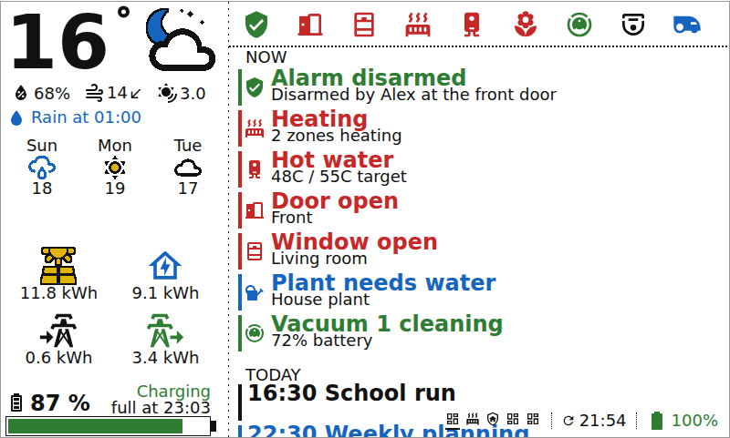
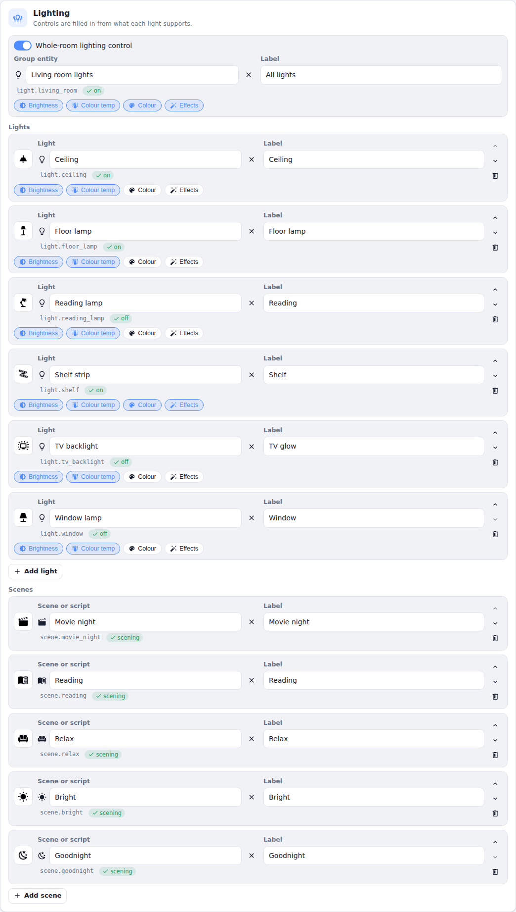
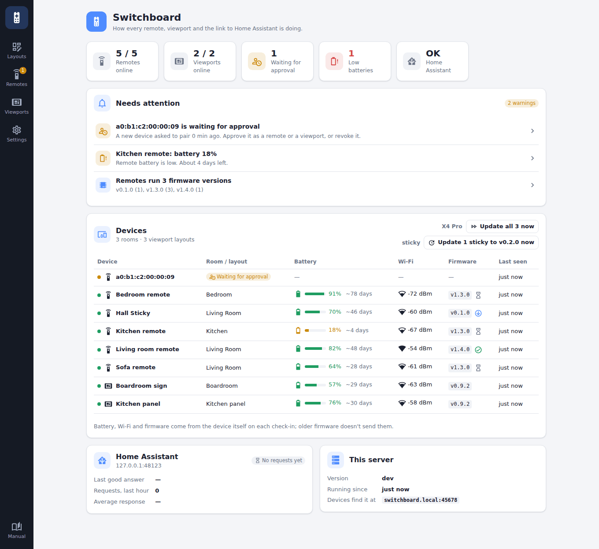

# Switchboard Server

**One small server for every e-ink screen in your home.** Switchboard Server runs your [Switchboard](https://github.com/stumarti/Switchboard) devices: the X4 Pro remotes you pick up off the wall, and the colour [viewport](https://github.com/stumarti/Switchboard-Viewport) wall displays. You build each one's screens in your browser, with a live preview from Home Assistant, and every device picks them up on its own. It's one Docker container, with nothing to install in Home Assistant.

<p>
  
  
</p>

**[⚡ Flash a remote or a viewport](https://stumarti.github.io/Switchboard/)** · **[Read the manual](https://stumarti.github.io/Switchboard/manual/)** · **[Try the demo](#try-it-without-hardware)**

## Batteries that last

The server does the work so the devices barely have to. It talks to Home Assistant, works out every value, colour, icon and sentence, and dithers the album art. The devices just wake, draw and sleep:

- **A remote** (Xteink X4 Pro) runs for **about 30 days** on a charge with light use.
- **A viewport** (reTerminal E1002) runs for **around 3 months**. If a screen hasn't changed, the server says so, and the panel isn't redrawn at all.

The server learns how fast each battery drains, so you know **how many days each device has left**. It warns you before one runs low, and can publish the batteries to Home Assistant for your own alerts. See [Battery life](https://stumarti.github.io/Switchboard/manual/server/battery-life.html).

<p></p>

## What it does

- **Every screen is built here.** A room's remote has its lights, blinds, music, TV, climate and Quick Access. A wall display gets screens made from twenty-five section types: weather, energy, the home battery, heating, security, calendar, departures, bins, air quality, a guest Wi-Fi code and more. The devices are dumb hardware: change a layout and they follow.
- **Live previews** of each remote page and each viewport screen, drawn from your Home Assistant as you edit.
- **Pair once.** Devices find the server by mDNS (`switchboard.local`), and you approve each from the admin UI.
- **Keep an eye on them:** the Home page shows every device's battery and days left, Wi-Fi signal, firmware and last check-in, and anything that needs attention.
- **Over-the-air updates** from GitHub releases, one device at a time or all at once, checked and rolled back if they fail.
- **Make it yours** with a theme for the icons and font.

<table>
<tr>
  <td><br><sub>A viewport layout: its screens and timing, and the picked screen above its sections</sub></td>
  <td><br><sub>Settings: firmware updates, rolled out by board, pilots first</sub></td>
</tr>
</table>

Get this running and set up at least one room or viewport layout *before* you flash a device: each one pulls its whole setup from here.

## Quick start

```yaml
services:
  switchboard-server:
    image: ghcr.io/stumarti/switchboard-server:latest
    container_name: switchboard-server
    network_mode: host   # required — mDNS needs it, see below
    environment:
      - PORT=45678
      - MDNS_HOSTNAME=switchboard.local
    volumes:
      - ./data:/data
    restart: unless-stopped
```

```sh
mkdir -p data
docker compose up -d
```

Then:

1. Open `http://<your-server-ip>:45678` and set an admin password.
2. **Settings → Home Assistant:** enter its address and a long-lived access token, save, then press **Test**.
3. **Settings → Wi-Fi networks:** the network remotes should join.
4. **Layouts:** create a room (for a remote) or a viewport layout, and fill in its Home Assistant entities. **Start from… → Kitchen dashboard** gives you a whole kitchen dashboard to adapt.
5. [Flash a remote or a viewport](https://stumarti.github.io/Switchboard/) and approve it on the **Remotes** page, choosing its room or layout.

This exact file is `docker-compose.yml` in this repo — grab it directly instead of retyping it.

Every Switchboard remote on your network finds the server automatically via `switchboard.local`. **Host networking is required** for that: mDNS needs multicast, which doesn't cross Docker's default bridge network. On **Unraid**, use this repo's `unraid-template.xml`. See [Configuration](https://stumarti.github.io/Switchboard/manual/server/configuration.html) for both, and for every environment variable.

> Keep this server on your LAN: it holds your Home Assistant token and Wi-Fi password, and can update every remote's firmware. See [Security](https://stumarti.github.io/Switchboard/manual/server/security.html).

## Try it without hardware

```sh
npm install
node tools/demo/demo.js
```

Then open `http://localhost:45680` (password `demo`): a pretend Home Assistant with a whole house in it, and this server seeded with rooms, remotes, wall displays and a firmware release. See [Try the demo](https://stumarti.github.io/Switchboard/manual/demo.html).

## Manual

**[The Switchboard manual](https://stumarti.github.io/Switchboard/manual/)** covers the server, the remote and the viewport, with screenshots of every page. It lives beside the web flasher, in the firmware repository's GitHub Pages.

- The admin UI: [Home](https://stumarti.github.io/Switchboard/manual/server/home.html), [remote layouts](https://stumarti.github.io/Switchboard/manual/server/remote-layouts.html), [remotes](https://stumarti.github.io/Switchboard/manual/server/remotes.html), [viewports](https://stumarti.github.io/Switchboard/manual/server/viewports.html), [settings](https://stumarti.github.io/Switchboard/manual/server/settings.html)
- [Theme](https://stumarti.github.io/Switchboard/manual/server/theme.html) · [Remote updates](https://stumarti.github.io/Switchboard/manual/server/remote-updates.html) · [Battery life](https://stumarti.github.io/Switchboard/manual/server/battery-life.html) · [Pairing & auth](https://stumarti.github.io/Switchboard/manual/server/pairing-and-auth.html)
- [Configuration](https://stumarti.github.io/Switchboard/manual/server/configuration.html) · [Security](https://stumarti.github.io/Switchboard/manual/server/security.html)
- [API](https://stumarti.github.io/Switchboard/manual/server/api.html) · [Profile format](https://stumarti.github.io/Switchboard/manual/server/profile-format.html) · [Development](https://stumarti.github.io/Switchboard/manual/server/development.html)
