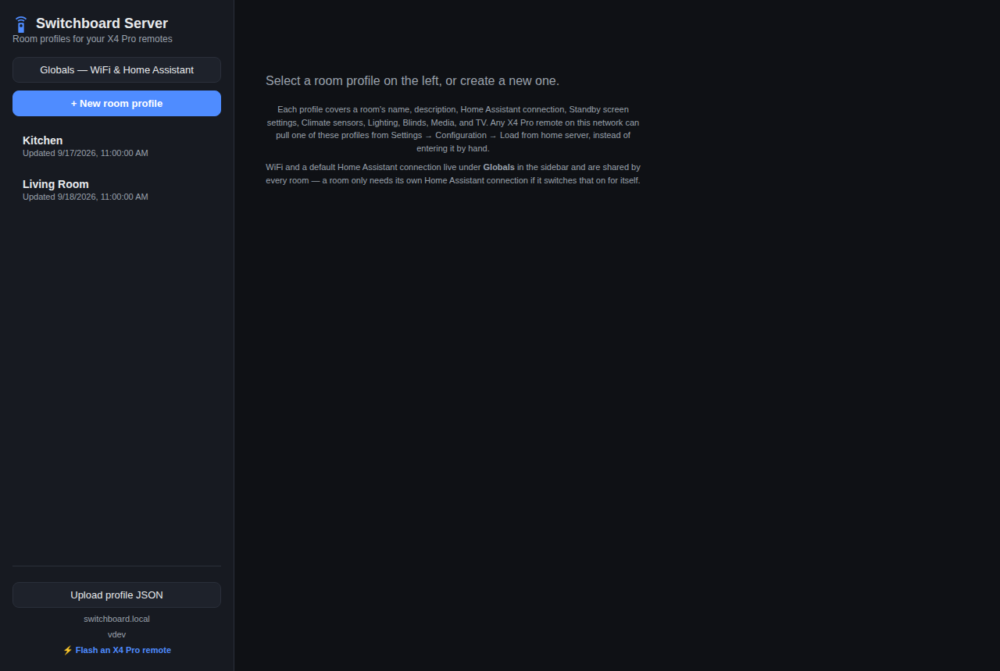
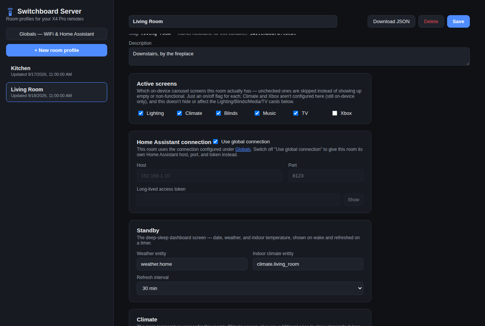
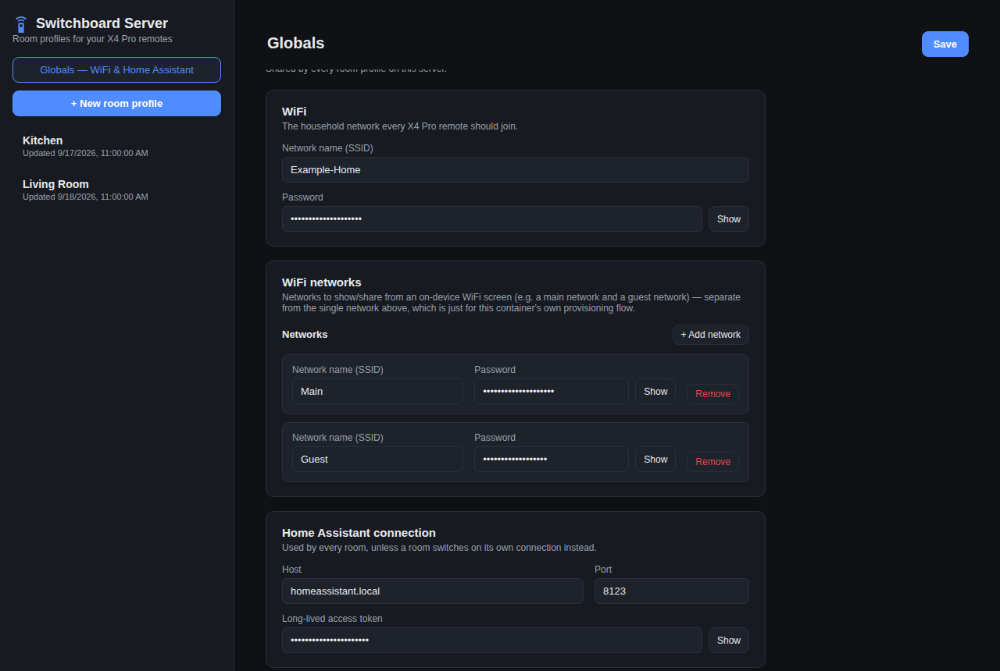

# Switchboard Server

The home server companion for [Switchboard](https://github.com/stumarti/Switchboard), the X4 Pro smart-home remote. Run one instance for your whole household — it stores each room's setup (lighting, blinds, climate, media, TV) and every remote pulls its config from it, instead of you typing it in by hand on each device.

**[⚡ Flash an X4 Pro remote](https://stumarti.github.io/Switchboard/)**

## How this fits together

This is step one. Get this running and set up at least one room *before* you flash a remote — the device pulls its whole setup from here, so there's nothing useful for it to show until a room exists.

1. **Run this** (below) and create a room.
2. **Flash a remote** — see the [Switchboard README](https://github.com/stumarti/Switchboard) for that half.
3. On the remote: join Wi-Fi, then **Settings → Select room** to attach it to the room you just created here.

## Screenshots

<table>
<tr>
  <td><br><sub>Room list</sub></td>
  <td><br><sub>Editing a room</sub></td>
</tr>
<tr>
  <td colspan="2"><br><sub>Globals — shared WiFi & Home Assistant</sub></td>
</tr>
</table>

- **Room list** (left sidebar) — every room you've set up, plus buttons to add a new one or jump to Globals.
- **Room profile** — one room's whole setup: its Home Assistant connection (or "use the shared one"), the Standby weather/temperature entities, and cards for Lighting, Blinds, Media, Climate, TV and Xbox. The **Active screens** checkboxes at the top control which of these actually show up on that room's remote.
- **Globals** — the household-wide WiFi network, a list of WiFi networks to show as join-QR codes on remotes, and the default Home Assistant connection every room uses unless it opts out.
- **Devices** — every physical remote that has ever contacted this server: approve a pending one (assigning its default room in the same step), rename it, change its room later, or revoke/delete it. See "Pairing" below.
- **Theme** — pick a font and re-skin any of the ~107 icons the firmware draws, compiled by this server and downloaded automatically by every paired remote. See "Theme" below.

> **⚠️ Upgrading from an older version?** This release adds auth: the admin UI now requires a password, and remotes must pair before they can fetch config. See "Auth" and "Pairing" below, and the **Migrating from an unauthenticated version** section — existing already-flashed remotes need reflashing plus a one-time pairing approval.

## Quick start (Docker Compose)

```yaml
services:
  switchboard-server:
    image: ghcr.io/stumarti/switchboard-server:latest
    container_name: switchboard-server
    network_mode: host   # required — mDNS needs it, see below
    environment:
      - PORT=45678
      - MDNS_HOSTNAME=switchboard.local
    volumes:
      - ./data:/data
    restart: unless-stopped
```

```sh
mkdir -p data
docker compose up -d
```

Open `http://<your-server-ip>:45678`, create a room, done. Every Switchboard remote on your network finds it automatically via `switchboard.local`.

This exact file is `docker-compose.yml` in this repo — grab it directly instead of retyping it.

### On Unraid

Add Container → Template → point it at this repo's `unraid-template.xml`. Set the **Data** path to wherever you want profiles saved (defaults to `/mnt/user/appdata/switchboard-server/data`) and apply.

> **Host networking required.** mDNS (how remotes find `switchboard.local` automatically) needs multicast, which doesn't cross Docker's default bridge network. Without `network_mode: host`, the admin UI still works fine at `http://<ip>:45678` — remotes just can't auto-discover it, and you'd need to set the host/port by hand in each remote's firmware config.

### Private image?

If this repo is private, GHCR images are private by default too — `docker login ghcr.io -u stumarti` with a GitHub token (`read:packages` scope) before pulling. Or make the package public from its GitHub page if you'd rather skip that.

## What it does

- **Rooms** — one profile per room (lighting, blinds, media, climate, TV, Xbox): which Home Assistant entities it has, one card per function. Entity fields search Home Assistant's own entity list (through the server, which holds the token), show each entity's live state, flag ids HA doesn't know, and fill in names, icons and supported light controls for you. With HA unreachable they fall back to plain text boxes.
- **Remotes** and **Viewports** — every paired device, listed beside the menu. A remote gets its own carousel (page cards you drag into order and switch on/off, each showing what its room gives it), its own Quick Access hub and refresh interval; a viewport (a colour wall-mounted e-ink display) gets a board of tiles. New devices appear under Remotes to approve, as either kind.
- **Settings** for the Home Assistant connection (with a connection test), device and guest Wi-Fi, the clock's NTP server, and the theme (icon and font packs, custom icons).

The admin UI is plain ES modules — Preact + htm served from `node_modules`, Material Design Icons from `@mdi/svg` — so there is no build step.
- Advertises itself on the LAN (`switchboard.local`) so remotes find it with zero configuration.

Every Switchboard remote already talks to this: `Settings → Select room` calls `GET /api/devices`, and each data refresh makes two requests — `GET /api/devices/<slug>/bundle` (its room's config, the shared WiFi/HA connection and theme versions; a bodyless `304` when nothing changed) and `GET /api/devices/<slug>/state` (the room's live Home Assistant state, which the server fetches from HA in parallel). Older firmware uses `GET /api/devices/<slug>/config` and `GET /api/globals` and talks to HA directly; those still work. For `/state` the server must be able to reach Home Assistant at the host in Globals — if it can't, the remote falls back to asking HA itself. Every one of these three now requires the remote to be paired (see "Pairing" below) — the admin UI's own browser session works too, so nothing changes for you in the UI itself.

| Method | Path | Purpose | Auth |
|---|---|---|---|
| GET | `/api/devices` | List rooms | session or device |
| GET | `/api/devices/<slug>/config` | One room's full config | session or device |
| GET | `/api/devices/<slug>/bundle` | Room config + globals + theme versions in one response (`304` when unchanged, via `If-None-Match`) | session or device |
| GET | `/api/devices/<slug>/state` | Live Home Assistant state for every entity the room's pages show, fetched in parallel by the server and trimmed to what the remote reads (`502` if HA is unreachable from the server) | session or device |
| POST | `/api/devices/<slug>/config` | Create/update a room | session |
| POST | `/api/devices` | Create a room from just a name | session |
| DELETE | `/api/devices/<slug>` | Remove a room | session |
| GET | `/api/globals` | Shared WiFi + Home Assistant connection | session or device |
| POST | `/api/globals` | Update Globals | session |
| GET | `/api/health` | Liveness, version, mDNS info | none |
| GET | `/api/auth/status` | `{authenticated, setupRequired}` | none |
| POST | `/api/auth/setup` | Set the admin password (first run only) | none |
| POST | `/api/auth/login` / `/api/auth/logout` | Session cookie in/out | none |
| POST | `/api/pairing/register` | A device's first-ever contact | none (device self-registers) |
| GET | `/api/pairing/devices` | List every device that's contacted the server | session |
| POST | `/api/pairing/<mac>/approve` | Approve a pending device, optionally assign its room | session |
| POST | `/api/pairing/<mac>/assign` \| `/rename` \| `/revoke` | Change room / rename / revoke | session |
| DELETE | `/api/pairing/<mac>` | Remove a device record | session |
| GET | `/api/theme` | Current icon/font pack version stamps | session or device |
| GET | `/api/theme/icons.pack` \| `/fonts.pack` | The compiled binary a device downloads | session or device |
| GET | `/api/assets/icon-slots` | The ~107 named icon slots, for the Theme page | session |
| GET | `/api/assets/icons/search?q=` | Search MDI icons (with previews) | session |
| POST | `/api/assets/icons/compile` \| `/api/assets/fonts/compile` | Compile + publish a new theme | session |

## Auth

A single shared admin password protects this UI — set it from the one-time setup screen the first time you open the server, or via the `ADMIN_PASSWORD` env var (which seeds/overwrites the stored password on every container start, so you can rotate it through docker-compose the same way every other setting here works). Sessions are a plain cookie, in-memory server-side — restarting the container signs everyone out, which is fine for a household admin tool.

This stays plain HTTP by design (LAN-only, same trust model as everything else here) — don't port-forward it regardless.

## Pairing

A physical remote pairs with this server once: on first boot it registers itself by MAC address and shows up under **Devices** as `pending`. Approve it there (optionally assigning its room in the same step — that's also the MAC → default room mapping) and the server hands it a long-lived token, which it stores and sends on every request from then on. A revoked or deleted device's old token stops working immediately.

If a paired device ever loses its stored token (e.g. a factory reset), it re-registers with the same MAC and gets a fresh token automatically — no need to re-approve it, since the trust decision was already made the first time.

## Theme

The **Theme** page compiles the firmware's on-screen look — one font (upload a TTF/OTF, or name a Google Font) and any of its ~107 named icons (search Material Design Icons and assign a replacement per slot) — into two binary files every paired remote downloads automatically and loads from its SD card at runtime. Publishing recompiles and takes effect on every device's next check-in; nothing needs reflashing. An unmodified icon slot keeps its original look.

## Cutting a release

```sh
git tag v1.0.0
git push origin v1.0.0
```

That's it — `.github/workflows/release.yml` builds the image and pushes `ghcr.io/stumarti/switchboard-server:latest` and `:1.0.0`, and creates a GitHub Release. `.github/workflows/ci.yml` runs a lighter build-check on every push so a broken build never gets that far.

## Config reference

| Variable | Default | What it does |
|---|---|---|
| `PORT` | `45678` | HTTP port |
| `DATA_DIR` | `/data` | Where room profiles are stored |
| `MDNS_HOSTNAME` | `switchboard.local` | Hostname advertised on the LAN |
| `MDNS_SERVICE_TYPE` | `switchboard` | DNS-SD service type — carries the port automatically for anything that queries it properly |
| `MDNS_IP` / `MDNS_INTERFACE` | auto | Force the advertised IP/NIC if auto-detect picks wrong (common on multi-NIC boxes) |
| `DISABLE_MDNS` | off | Set `1` to turn off discovery entirely |
| `ADMIN_PASSWORD` | unset | Seeds/overwrites the admin UI's password on every start. Leave unset to set it once from the UI's own setup screen instead. |

## Security

Plain HTTP, LAN-only by design — same trust model as the on-device config form it replaces, now with a login gate on the admin UI and per-device pairing tokens instead of the previous no-auth-at-all posture (see "Auth" and "Pairing" above). This server still holds *every* room's Home Assistant token plus your WiFi password in one place, so: keep it off the internet, don't port-forward it, and treat it like any other credential store on your network.

## Migrating from an unauthenticated version

`/api/devices`, `/api/devices/<slug>/config`, and `/api/globals` now require either an admin session or a paired device token. If you're updating from a version of this server that predates auth:

1. Update this server first and set an admin password from its one-time setup screen (or `ADMIN_PASSWORD`).
2. Reflash every physical remote with a firmware version that supports pairing (see the [Switchboard README](https://github.com/stumarti/Switchboard)) — an older firmware has no token to send and will get `401`s fetching its config.
3. Each remote shows up under **Devices** as `pending` on its first boot after reflashing; approve it (assigning its room) from there.

Existing room profiles, Globals, and any already-compiled theme carry over unchanged — this only affects how a client authenticates, not what's stored.

## Secrets & your first commit

`data/` holds real credentials once you start using this — Home Assistant tokens, WiFi passwords. `.gitignore` already excludes it (`data/*`, keeping only `.gitkeep`), so it's safe to `git add -A` without checking each time.

One gotcha in local dev: running `npm start` without setting `DATA_DIR` writes straight into this repo's own `data/` folder. Harmless now that it's gitignored, but set `DATA_DIR` to somewhere outside the repo anyway (e.g. `DATA_DIR=/tmp/sb-dev`) so test data doesn't pile up here.

## Local development

```sh
npm install
DATA_DIR=/tmp/sb-dev DISABLE_MDNS=1 npm start
```

Open `http://localhost:45678`.

## Profile shape

Each room profile, in full:

```json
{
  "slug": "living-room",
  "name": "Living Room",
  "description": "",
  "homeAssistant": { "useGlobal": true, "host": "", "port": 8123, "token": "" },
  "standby": { "weatherEntity": "weather.home", "climateEntity": "climate.living_room", "refreshIntervalMin": 30 },
  "lighting": {
    "group": { "enabled": true, "name": "All lights", "entity": "light.living_room_group", "controls": { "brightness": true, "colorTemp": true, "color": false, "effects": false } },
    "lights": [ { "id": "...", "name": "Lamp", "entity": "light.lamp", "controls": { "brightness": true, "colorTemp": true, "color": true, "effects": true } } ],
    "scenes": [ { "id": "...", "name": "Movie Night", "entity": "scene.movie_night" } ]
  },
  "blinds": {
    "group": { "enabled": true, "name": "All blinds", "entity": "cover.living_room_group" },
    "items": [ { "id": "...", "name": "Bay Window", "entity": "cover.bay_window" } ]
  },
  "screens": { "lighting": true, "climate": true, "blinds": true, "music": true, "tv": false, "xbox": false },
  "media": { "enabled": true, "name": "Living Room Speaker", "entity": "media_player.spotify" },
  "climate": { "entity": "sensor.living_room_temp", "additionalSensors": [] },
  "tv": { "mediaPlayerEntity": "media_player.tv", "remoteEntity": "remote.tv", "apps": { "youtube": "...", "netflix": "...", "tvMate": "..." } },
  "xbox": {
    "enabled": true,
    "name": "Xbox",
    "mediaPlayerEntity": "media_player.xbox_series_x",
    "remoteEntity": "remote.xbox_series_x",
    "listSource": "configured",
    "games": [ { "id": "...", "name": "Halo Infinite", "productId": "9PP5TF5D0S0X", "art": "https://.../halo.jpg" } ]
  }
}
```

A few things worth knowing:

- `homeAssistant.useGlobal: true` (the default for a new room) means this room uses the Globals connection instead of its own host/port/token.
- `screens` just turns carousel pages on/off per room — a bedroom with no Xbox unchecks it.
- `lighting.lights`, `lighting.scenes`, `blinds.items`, `climate.additionalSensors`, `xbox.games` are all open-ended lists — add/remove as many as the room needs.
- `tv.apps` is fixed to three slots (YouTube / Netflix / tvMate); `xbox.games` isn't — a console's library keeps growing.
- `xbox.listSource` picks whether the device shows the `games` list below or browses the console live via Home Assistant's `browse_media`. Either way, the now-playing hero art isn't stored here — the device reads that live from the media player entity's own `entity_picture`/`media_image_url`. A game's `art` field is only for its library row, and only used when `listSource` is `"configured"`.

The Globals record (`/data/_globals.json`) is the same shape minus the room-specific fields, plus `wifi` (this container's own provisioning network) and `wifiNetworks` (a household list shown as join-QR codes on the remote's WiFi screen).
